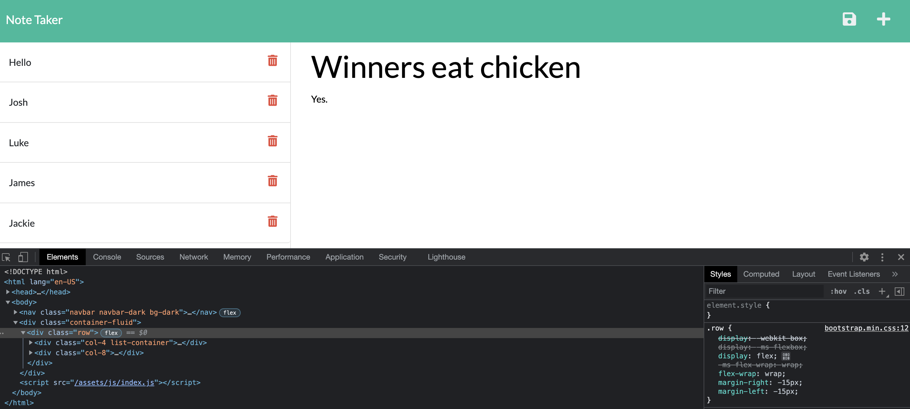

# Note Taker Starter Code

**Version 1.0.0**

## Description 
The purpose of this project was to establish routes to make a note taker application function properly in terms of persistence, addition of new notes in the data set, and functionality to delete notes from the data set.

## Significant Changes
Routes were designated based on if they were directed towards the client side or server side. On the client side we made it so the index and note html were displayed to the user. On the server side we read the data set via a get route, added data via the post method, and used the delete method to remove data from the json data set.

## Challenges
The biggest challenge was theoretical rather than coding complexity. As boiler plate we received the index.js file however the challenge was in order to effectuate a route that was sensible one would need a solid understanding of what the index.js file was doing in terms of the various functions being applied. 

## Screenshot 

### Deployed Link 
https://nahom-assefa.github.io/Note-Taker/

### Heroku Link
https://git.heroku.com/nahom12notetaker.git

#### License
License and Copyright © Xander Rapstine, Trilogy Education Services/2U